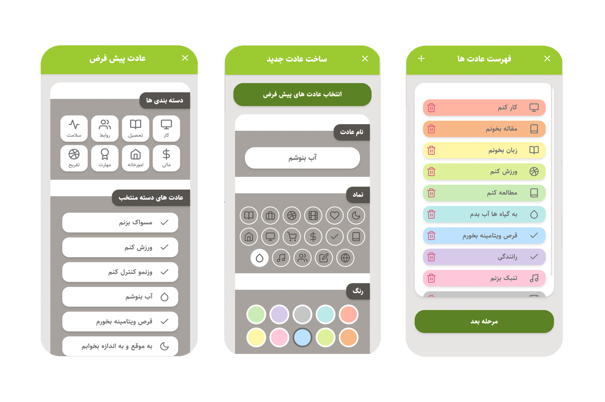
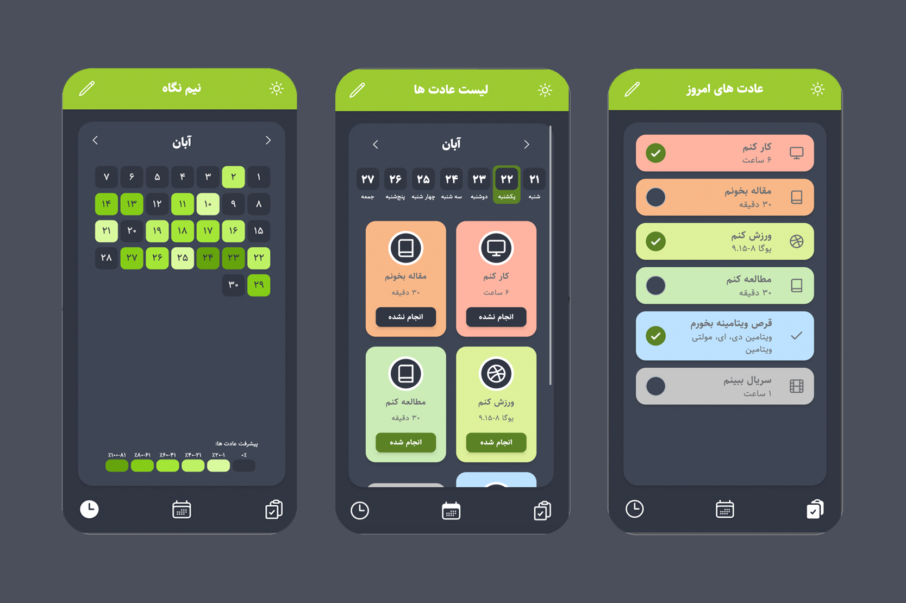

 # Adatyar

## Introduction
Adatyar is a habit tracker **mobile web application** that helps you create and track your habits.
A user starts by making a list of habits. He/she can choose from the recommended habits or create new custom habits.

### TodayHabits - عادت های امروز
In the next step, the application provides a daily list for users to check the habits they have accomplished.

### HabitsList - لیست عادت ها
Users can also monitor each day's list, which contains habits it's and their statuses (completed or not).

### Overview - نیم نگاه
In addition, each month has a heat map showing days' progress in color. Moreover, users can see a brief report of each day's habits and whether they have been completed.


## Frameworks and Libraries
The project is made by:

- [Vue 3](https://vuejs.org/)
- [Vite](https://vitejs.dev/)
- [Tailwind CSS](https://tailwindcss.com/)
- [Persian Date](https://github.com/babakhani/PersianDate/)
- [lowdb](https://github.com/typicode/lowdb/)
- [Heroicons](https://heroicons.com/)
- [Feather-icons](https://feathericons.com/)


## Screenshots





## Installation
For running the project:

```
yarn
yarn dev
```